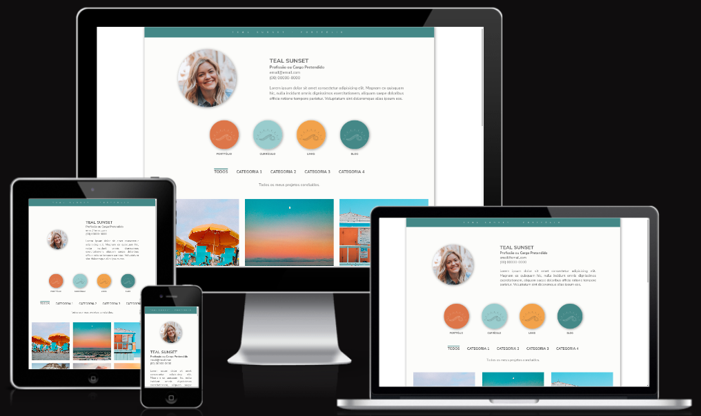

# Teal Sunset

## SUMARIO

   * [Descrição do Projeto](#DESCRIÇÃO-DO-PROJETO)
   * [Deploy](#DEPLOY)
   * [Linguagens e ferramentas utilizadas](#LINGUAGENS-E-FERRAMENTAS-UTILIZADAS)
   * [Considerações](#CONSIDERAÇÕES)
   * [Licença e restrições](#LICENÇA-E-RESTRIÇÕES)

## DESCRIÇÃO DO PROJETO

Projeto criado com o objetivo de ser um modelo para página de portfólio integrada a blog e currículo, possivelmente para meu próprio uso. 

Comecei o projeto para treinar alguns conceitos de design que venho estudando e para praticar SASS, que havia começado a estudar recentemente. 

Desenhei alguns wireframes, à lápis mesmo, com a ideia de um layout inspirado nos perfis do instagram, devido ao alto apelo visual. 

Utilizei o Pinterest pra buscar inspirações de cores e gerei a paleta do projeto usando o site <a href="https://coolors.co/">coolors</a>.

Em seguida, busquei imagens livres para uso no site <a href="https://unsplash.com/">Unsplash</a>.

## DEPLOY

O deploy do projeto está disponível <a href="https://teal-sunset.netlify.app/">aqui</a>.

## LINGUAGENS E FERRAMENTAS UTILIZADAS

Foram usados no projeto: HTML5, SASS e Javascript. 

Utilizei no projeto o VS Code e o Github desktop, mudando posteriormente para o GitKraken.

Todos os ícones vieram da biblioteca <a href="https://fontawesome.com/">FontAwesome</a>..

## CONSIDERAÇÕES

Foi imensamente divertido construir este projeto do zero: pesquisar wireframes, rascunhar o modelo, depois preencher esse modelo com cores e imagens, e então desenvolver. Pretendo me aprofundar nos conceitos de UX/UI e nos princípios de design para elaborar outros projetos semelhantes no futuro. 

O projeto foi marcado como concluído pois a proposta inicial foi finalizada: o layout foi desenhado e construído conforme o planejado. Algumas idéias de melhorias ficaram, porém, evidentes agora que o projeto inicial foi concluído. É possível que reabra e expanda o projeto no futuro para incluir:

   * Animações, especialmente na filtragem de categorias da página de portfólio e no gráfico de conhecimentos.
   * Criar a página de links, que não existia no projeto original e cujo link foi incluído na home por razões estéticas.
   * Permitir a inclusão (ainda que temporária) de outros comentários na página de postagems (blog).
   * Fazer as integrações com o Pinterest e com ferramenta de encaminhamento de postagens. 

Pretendo também:

   * Transformar o modelo em tema WordPress, utilizando PHP.
   * Refazer o projeto usando Angular.

## LICENÇA E RESTRIÇÕES

Este projeto foi criado sob a licença Creative Commons de Atribuição Não Comercial Compartilha Igual 3.0 Brasil (CC BY-NC-SA 3.0 BR). Você pode obter todos os detalhes sobre esse tipo de licença <a href="https://creativecommons.org/licenses/by-nc-sa/3.0/br/">aqui</a>, mas se estiver com preguiça, aqui vai o resumo:

Quer usar pra montar seu portfólio/blog/currículo? Pode. 

Você pode compartilhar: copiar e redistribuir o material em qualquer suporte ou formato que quiser. Pode adaptar como achar melhor: remixar, transformar, e criar a partir do material. 

Desde que cumpra algumas regras dessa licença: 

Atribuição: não vale dizer que foi você quem fez. Tem que fazer a atribuição para esta que vos fala e indicar se fez alguma alteração em relação ao original.

Não-Comercial — Você não pode usar o material para fins comerciais (não pode sair por aí vendendo o projeto da coleguinha né, que é feio isso).

Compartilha Igual — Se você remixar, transformar, ou criar a partir do material, tem de distribuir as suas contribuições sob a mesma licença que o original. Ou seja, tem que usar a mesma licença. 

Qualquer dúvida, sugestão ou comentário, fico a disposição. 
